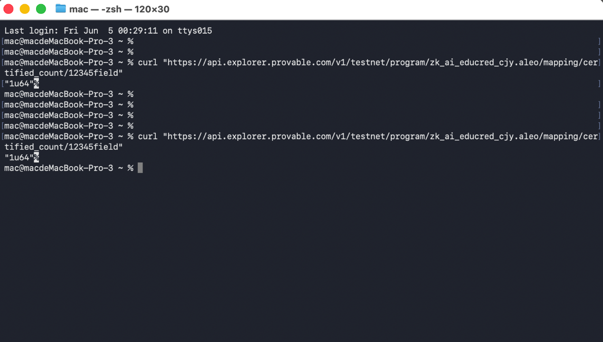
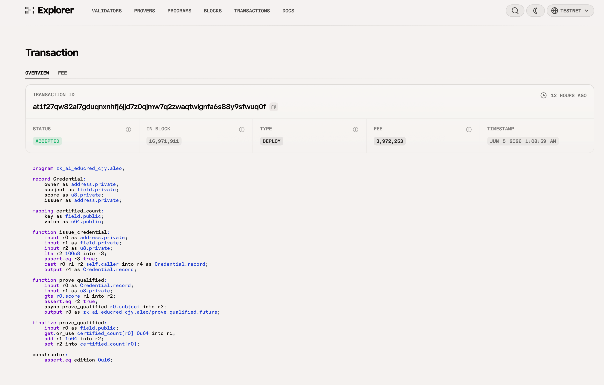
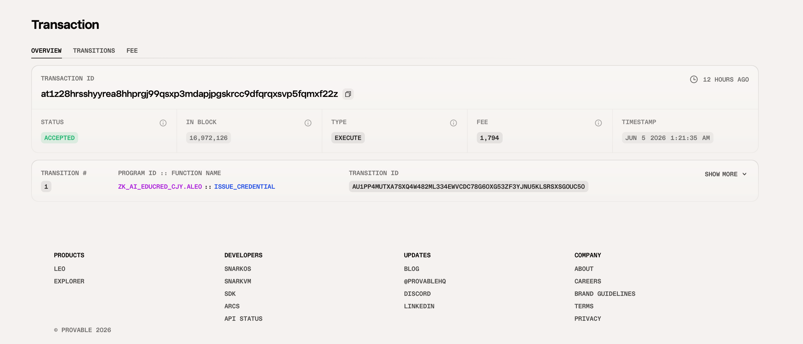
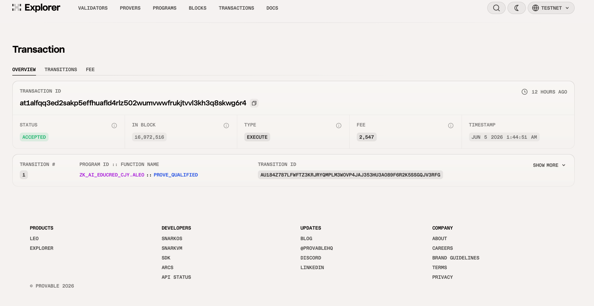
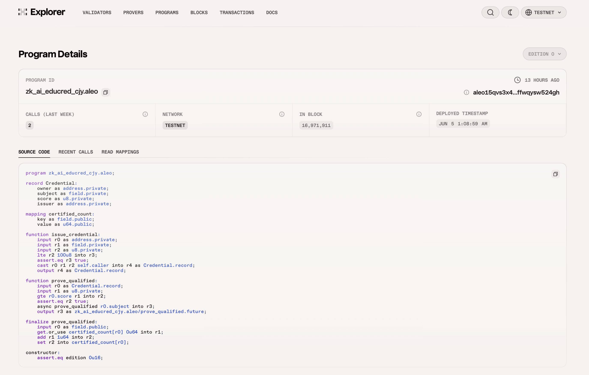

# Task 4 - 用起来：真实场景落地

## 🎯 项目：知证 ZK-EduCred —— 隐私 AI 学习能力凭证系统

> Privacy-Preserving AI Learning Credential on Aleo

🌐 **Live Demo：https://1739467001-svg.github.io/Aleo-101-Bootcamp/**

**程序 ID**：`zk_ai_educred_cjy.aleo`  
**部署网络**：Aleo Testnet  
**作者**：CJY 陈俊烨（1739467001-svg）

---

## 一、为什么做这个？（契合「AI 隐私」主题）

我本人长期从事 **AI 教育系统 / AI 多模态** 开发，深知一个真实痛点：

> AI 评估系统（自动批改、能力测评、AI 面试、隐私征信）会给人打出一个**分数**。
> 这个分数和背后的原始数据（答题内容、行为日志、面试表现）**极度敏感**，
> 但现实里它们往往被平台明文存储、随意共享，用户毫无隐私可言。

而对外部（招聘方、认证机构、下游平台）真正需要的，往往**不是具体分数，而是「是否达标」这一个事实**。

**Aleo 的零知识证明恰好能优雅解决：让人证明「我的 AI 评估分数 ≥ 某阈值」，却不暴露具体分数和原始数据。**

---

## 二、核心设计

| 角色 | 操作 | 隐私性 |
|------|------|--------|
| AI 评估方 | `issue_credential` 签发加密分数凭证 | 分数封装进 Record，链上加密不可见 |
| 学习者 | `prove_qualified` 用 ZK 证明「分数达标」 | 具体分数全程不暴露，只产生"达标"事实 |
| 任何人 | 查询 `certified_count` 聚合统计 | 公开可验证，但无法关联个人 / 分数 |

### 隐私 vs 公开 边界

| 数据 | 链上可见性 |
|------|-----------|
| Credential 中的 `score`（AI 分数） | ❌ 加密隐藏 |
| 学习者与其分数的关联 | ❌ 不可关联 |
| 某学科「达标累计人数」 | ✅ 公开透明 |
| ZK 证明本身 | ✅ 可验证但零泄露 |

---

## 三、合约代码

完整代码见 [`contract/src/main.leo`](./contract/src/main.leo)。

```leo
program zk_ai_educred_cjy.aleo {
    record Credential {
        owner: address,
        subject: field,
        score: u8,        // AI 评估分数（私密）
        issuer: address,
    }
    mapping certified_count: field => u64;

    @noupgrade
    constructor() {}

    // 1) AI 评估方签发加密分数凭证
    fn issue_credential(learner: address, subject: field, score: u8) -> Credential {
        assert(score <= 100u8);
        return Credential { owner: learner, subject: subject, score: score, issuer: self.caller };
    }

    // 2) 零知识达标证明：证明 score >= threshold 而不暴露 score
    fn prove_qualified(cred: Credential, threshold: u8) -> Final {
        assert(cred.score >= threshold);
        let subj: field = cred.subject;
        return final {
            let current: u64 = certified_count.get_or_use(subj, 0u64);
            certified_count.set(subj, current + 1u64);
        };
    }
}
```

---

## 四、测试网部署信息

| 项目 | 值 |
|------|-----|
| 程序名称 | `zk_ai_educred_cjy.aleo` |
| 网络 | Aleo Testnet |
| 部署者地址 | `aleo14ejwcxgkeanq99wv79nfwk96h6lv9p4s82xj3zyykzfcprklaqxqxrvmj6` |
| 部署交易 ID | `at1f27qw82al7gduqnxnhfj6jjd7z0qjmw7q2zwaqtwlgnfa6s88y9sfwuq0f` |
| 部署区块 | `16,971,911` |
| 部署时间 | `JUN 5 2026 1:08:59 AM` |
| 部署费用 | `3.972253 credits` |
| 部署状态 | ✅ ACCEPTED |
| Explorer | https://testnet.explorer.provable.com/transaction/at1f27qw82al7gduqnxnhfj6jjd7z0qjmw7q2zwaqtwlgnfa6s88y9sfwuq0f |
| 程序页 | https://testnet.explorer.provable.com/program/zk_ai_educred_cjy.aleo |
| Leo 版本 | 4.1.0 |

---

## 五、链上交互记录

### 交互 1：签发隐私凭证 `issue_credential`

- 输入：学习者地址 + 学科 `12345field` + 分数 `87u8`（私密，链上不可见）
- 输出：加密 Credential Record，`score: 87u8.private`
- **交易 ID**：`at1z28hrsshyyrea8hhprgj99qsxp3mdapjpgskrcc9dfqrqxsvp5fqmxf22z`
- 区块：`16,972,126`
- 时间：`JUN 5 2026 1:21:35 AM`
- 费用：`1,794 microcredits (0.001794 credits)`
- 状态：✅ ACCEPTED
- Explorer：https://testnet.explorer.provable.com/transaction/at1z28hrsshyyrea8hhprgj99qsxp3mdapjpgskrcc9dfqrqxsvp5fqmxf22z

### 交互 2：零知识达标证明 `prove_qualified`（阈值 60，分数 87）

- 输入：加密 Credential + 阈值 `60u8`
- 输出：`certified_count[12345field]` +1（链上仅公开学科达标计数）
- **具体分数 87 全程未出现在链上** ← ZK 隐私核心验证
- **交易 ID**：`at1alfqq3ed2sakp5effhuafld4rlz502wumvwwfrukjtvvl3kh3q8skwg6r4`
- 区块：`16,972,516`
- 时间：`JUN 5 2026 1:44:51 AM`
- 费用：`2,547 microcredits (0.002547 credits)`
- 状态：✅ ACCEPTED
- Explorer：https://testnet.explorer.provable.com/transaction/at1alfqq3ed2sakp5effhuafld4rlz502wumvwwfrukjtvvl3kh3q8skwg6r4

### 交互 3：查询公开聚合统计（链上验证 ZK 结果）



```bash
curl https://api.explorer.provable.com/v1/testnet/program/zk_ai_educred_cjy.aleo/mapping/certified_count/12345field
```

程序页 CALLS (LAST WEEK): **4** ← 四次执行均已记录

### 交互 4：第2轮签发凭证 `issue_credential`（分数 92）

- 输入：学习者地址 + 学科 `12345field` + 分数 `92u8`（私密）
- **交易 ID**：`at1vv47d9xrcl3p0llkfjuwjtvp6hw2g6y72pjtej8ay47g6t4fdyyszw8auy`
- 状态：✅ ACCEPTED
- Explorer：https://testnet.explorer.provable.com/transaction/at1vv47d9xrcl3p0llkfjuwjtvp6hw2g6y72pjtej8ay47g6t4fdyyszw8auy

### 交互 5：第2轮 ZK 达标证明 `prove_qualified`（阈值 80，分数 92）

- ZK 证明：分数 92 ≥ 80，达标 ✅，分数本身不泄露
- 链上效果：`certified_count[12345field]` 从 1 变为 **2**（系统可复用）
- **交易 ID**：`at168vg736pfdq2vat7qvmy3rac46sw2ehe6dkjsj8fpcaa7yqff5fqazx047`
- 状态：✅ ACCEPTED
- Explorer：https://testnet.explorer.provable.com/transaction/at168vg736pfdq2vat7qvmy3rac46sw2ehe6dkjsj8fpcaa7yqff5fqazx047

---

## 六、链上交互截图

### 部署交易（DEPLOY · ACCEPTED）


### issue_credential 执行（EXECUTE · ACCEPTED）


### prove_qualified 执行（EXECUTE · ACCEPTED）


### 程序页面（Program Details）


---

## 七、应用前景与扩展

- **在线教育认证**：课程结业证书可验证、防伪、保护学员成绩隐私
- **AI 招聘**：候选人证明「AI 测评达标」而不暴露具体分数排名
- **隐私征信**：证明信用评分达到放贷门槛而不泄露完整画像
- **多模态内容审核**：证明内容通过 AI 审核而不公开内容本身

> 本项目把我的真实专业方向（AI 教育 / 多模态）与 Aleo 隐私能力结合，
> 是「AI 隐私」赛道一个可落地、可扩展的真实场景应用。
