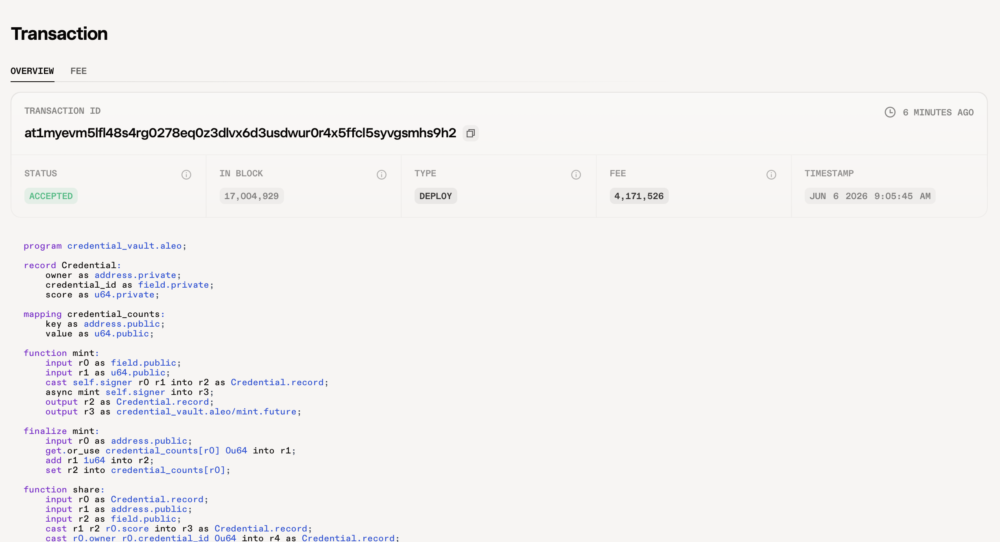
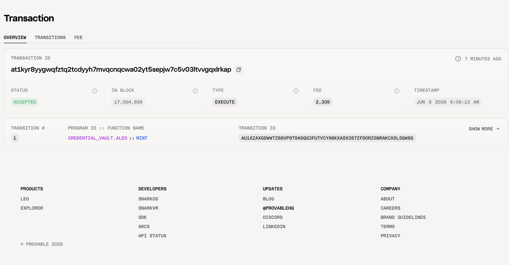

# Task 4 - 用起来：真实场景落地

## 项目概述

基于 Aleo 零知识证明协议的隐私凭证管理系统 — **Private Credential Vault**。

每个凭证作为私有 Record 存储，只有拥有者可以查看和操作，公共 mapping 只存储凭证计数，不暴露任何敏感数据。

## 核心功能

- **mint** - 铸造新的私有凭证
- **share** - 私密分享凭证（消耗原凭证，生成两个新记录）

## 隐私特性

- **Record = 私有数据**：凭证内容（score）仅拥有者可见
- **Mapping = 公开计数**：只暴露凭证数量，不暴露具体内容
- **ZK Proof = 链下生成**：零知识证明在本地生成，保护交易隐私

## 测试网合约地址

```
credential_vault.aleo
```

## 链上交易记录

| 项目 | 交易 ID |
|------|---------|
| 部署交易 | `at1myevm5lfl48s4rg0278eq0z3dlvx6d3usdwur0r4x5ffcl5syvgsmhs9h2` |
| 铸造交易 | `at1kyr8yygwqfztq2tcdyyh7mvqcnqcwa02yt5sepjw7c5v03ltvvgqxlrkap` |

## 链上交互截图

### 部署交易



### 铸造交易



## 代码

详见 `program/src/main.leo`

## 技术栈

- **语言**：Leo 4.2.0
- **网络**：Aleo Testnet (Consensus Version 15)
- **API**：Provable API
