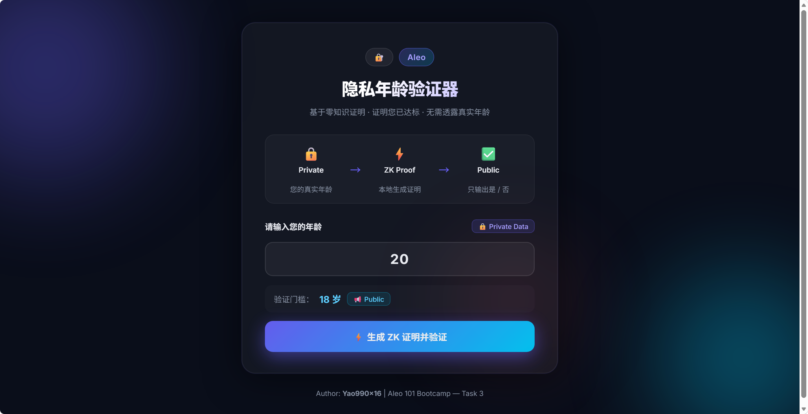
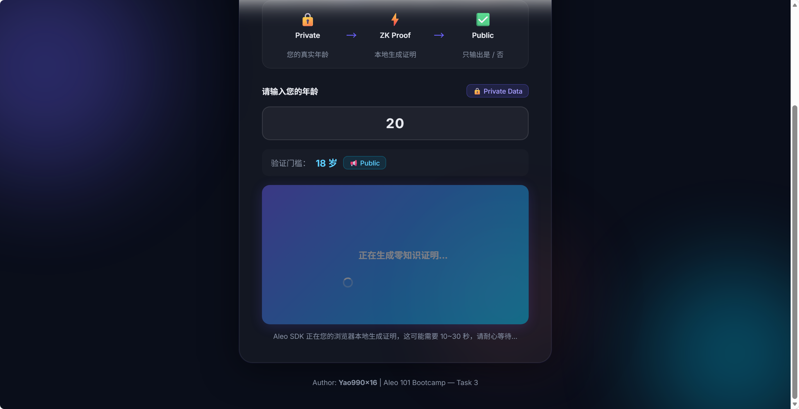
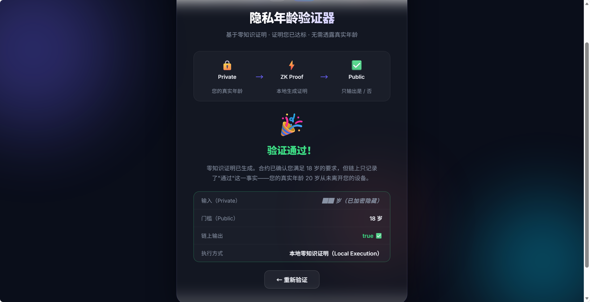

# Aleo 隐私年龄验证器 (ZK Age Verifier)

**Aleo 101 Bootcamp — Task 3 交付项目**
**Author:** Yao990x16

这是一个基于 **Aleo (Leo语言)** 和 **React 前端** 构筑的可交互隐私 dApp 演示。该项目展示了零知识证明（Zero-Knowledge Proofs）如何完美解决 Web2 中“自证身份却过度暴露隐私”的痛点。

---

## 💡 核心理念：年龄验证的隐私困局

在传统互联网中，要证明自己“已满 18 岁”（比如购买限制商品、进入网吧等），用户必须向服务器提供精确的出生年月日或身份证件。这带来了极大的数据泄露风险。

**本项目的解决方案：**
用户在本地设备上通过 Aleo SDK 生成一个零知识证明。智能合约只验证用户的真实年龄是否 `>= 18`，并在链上输出唯一的结论（`true` 或 `false`）。
**您的真实年龄数据永远不会离开您的本地设备。**

---

## 🛠️ 项目结构

- **`src/main.leo`**: Aleo 智能合约代码。
  - 核心逻辑：`fn verify_age(private age: u8, public age_limit: u8) -> bool`
  - 通过 `private` 关键字隐蔽用户的真实年龄，只对比并返回布尔值。
- **`frontend/`**: 基于 `create-aleo-app` 脚手架搭建的 React 前端。
  - 使用 `@aleohq/sdk` 在浏览器本地使用 WebAssembly (WASM) 生成并执行零知识证明计算。
  - 设计了完整的暗黑玻璃态（Glassmorphism） UI。

---

## 📸 Demo 流程展示

### 1. 启动主界面
用户可以在界面中输入自己的真实年龄（标记为 Private Data 隐私数据），下方显示系统预设的年龄门槛。



### 2. 本地生成 ZK 证明
点击验证后，系统调用 Aleo WASM SDK。在这个阶段，浏览器本地正在为您秘密生成一套零知识证明（耗时 10-30 秒），无需向任何云端服务器发送您的年龄。



### 3. 验证结果输出
执行完毕后，界面显示最终验证结果。在底部的记录元数据中可以清楚地看到：
- 输入的真实年龄已被**加密隐藏**。
- 最终链上公开输出的只有布尔结论（`true` 或 `false`）。



---

## 🚀 本地运行方式

1. 确保已安装 Node.js 和 npm。
2. 进入前端目录：
   ```bash
   cd frontend
   npm install
   npm run dev
   ```
3. 在浏览器打开 `http://localhost:5173/` 即可体验。
